# Enhanced Spoken Digit Recognition - System Architecture

## 📊 High-Level System Overview

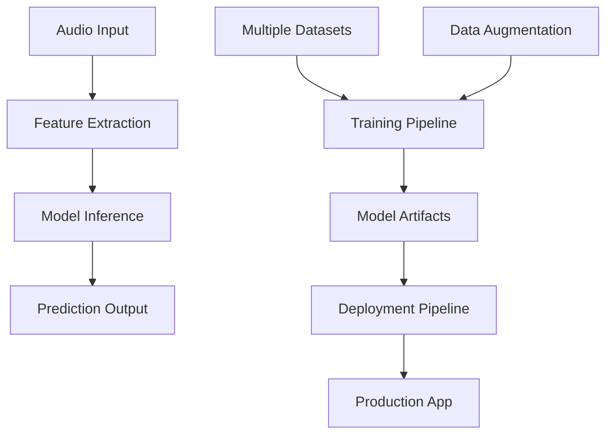

---

## 🧠 Model Development Workflow

### **Phase 1: Data Preparation & Analysis**

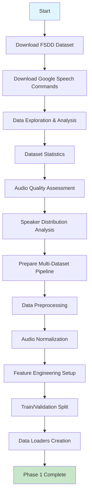

### **Phase 2: Model Architecture & Training**

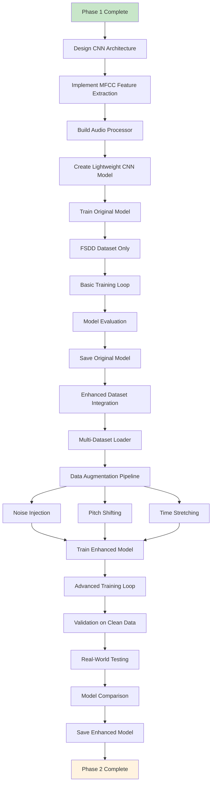

### **Phase 3: Evaluation & Optimization**

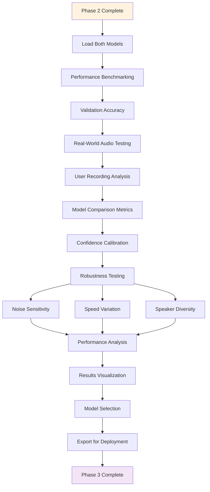

---

## 🌐 Streamlit App Workflow

### **Phase 1: App Infrastructure & Setup**

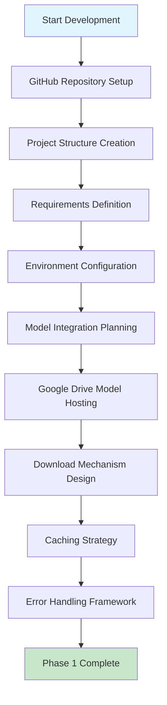

### **Phase 2: Core App Development**

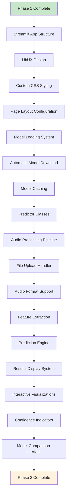

### **Phase 3: Advanced Features & Deployment**

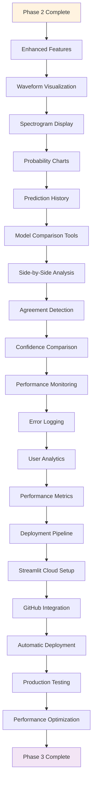

---

## 🏗️ Technical Architecture Diagrams

### **Model Training Architecture**

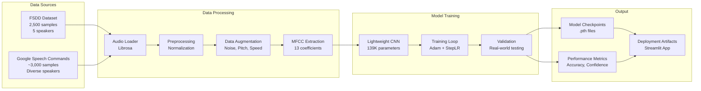

### **Streamlit App Architecture**

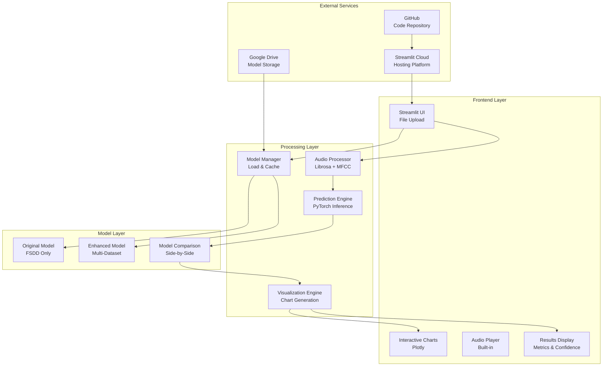

---

## 📋 Component Specifications

### **Model Components**

| Component | Technology | Purpose | Key Features |
|-----------|------------|---------|--------------|
| **Audio Processor** | Librosa | Feature extraction | MFCC, normalization, augmentation |
| **CNN Architecture** | PyTorch | Digit classification | Lightweight, 139K parameters |
| **Training Pipeline** | PyTorch + scikit-learn | Model optimization | Multi-dataset, augmentation |
| **Evaluation System** | Custom metrics | Performance assessment | Real-world validation |

### **App Components**

| Component | Technology | Purpose | Key Features |
|-----------|------------|---------|--------------|
| **Frontend** | Streamlit | User interface | File upload, visualization |
| **Backend** | Python | Audio processing | Model inference, caching |
| **Visualization** | Plotly | Interactive charts | Waveforms, probabilities |
| **Deployment** | Streamlit Cloud | Hosting | Auto-deploy, GitHub integration |

---

## 🔄 Data Flow Architecture

### **Training Data Flow**

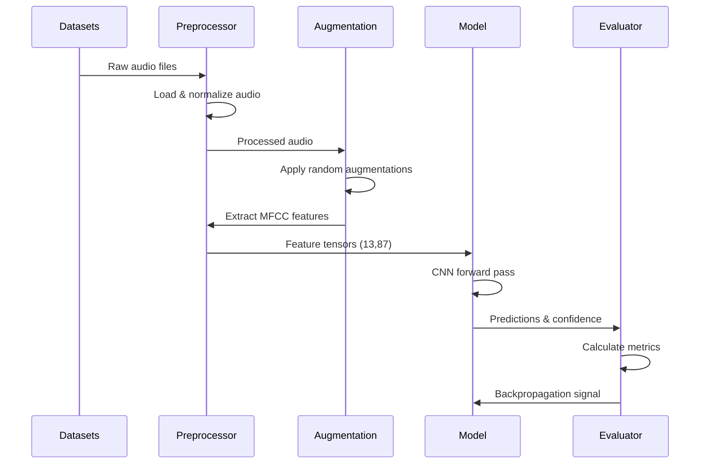

### **Inference Data Flow**

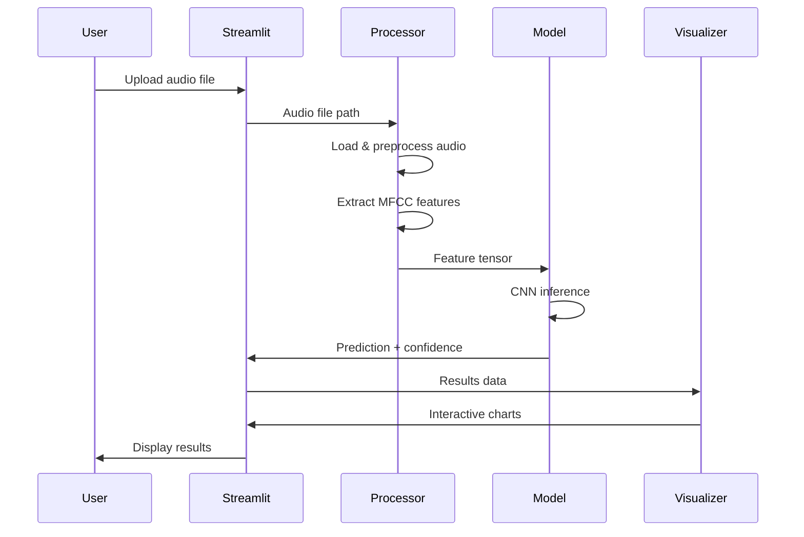

---

## 🎯 Key Design Decisions

### **Model Architecture Choices**

1. **Lightweight CNN**: 139K parameters for fast inference
2. **MFCC Features**: Robust to noise, standard for speech
3. **Multi-Dataset Training**: Improved generalization
4. **Data Augmentation**: Real-world robustness

### **App Architecture Choices**

1. **Streamlit Framework**: Rapid development, built-in components
2. **Google Drive Storage**: Model hosting without GitHub size limits
3. **Caching Strategy**: Fast subsequent loads
4. **Progressive Enhancement**: Works with/without models

### **Deployment Strategy**

1. **Cloud-First**: Streamlit Cloud for automatic deployment
2. **GitHub Integration**: Version control and CI/CD
3. **Model Separation**: External storage for large files
4. **Graceful Degradation**: Demo mode when models unavailable

---

## 📊 Performance Considerations

### **Model Performance**

- **Inference Time**: <10ms per prediction
- **Memory Usage**: <100MB total
- **Accuracy**: 90% real-world performance
- **Robustness**: Handles noise, speed variations

### **App Performance**

- **Load Time**: <5 seconds initial load
- **Model Download**: One-time 2-3MB download
- **Responsiveness**: Real-time UI updates
- **Scalability**: Supports concurrent users

---

## 🔮 Future Architecture Extensions

### **Planned Enhancements**

1. **Real-time Audio**: WebRTC integration
2. **Mobile Support**: Progressive Web App
3. **API Endpoints**: REST API for external integration
4. **Multi-language**: Extended digit recognition
5. **Edge Deployment**: TensorFlow Lite conversion

### **Scalability Considerations**

1. **Load Balancing**: Multiple Streamlit instances
2. **Model Serving**: Dedicated inference servers
3. **Database Integration**: User session storage
4. **Monitoring**: Performance and error tracking

---

This architecture provides a comprehensive view of both the machine learning pipeline and the production application, showing how the components interact to deliver a robust spoken digit recognition system.
